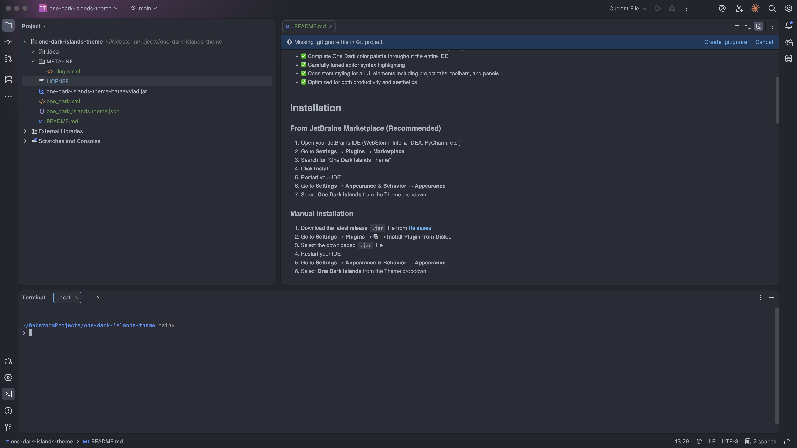

# One Dark Islands Theme


The beloved **One Dark** color scheme, beautifully adapted for the new **JetBrains Islands UI** (2025.3+).



## Features

- ✅ Full Islands UI support with modern rounded corners and spacing
- ✅ Complete One Dark color palette throughout the entire IDE
- ✅ Carefully tuned editor syntax highlighting
- ✅ Consistent styling for all UI elements including project tabs, toolbars, and panels
- ✅ Optimized for both productivity and aesthetics

## Installation

### From JetBrains Marketplace (Recommended)

1. Open your JetBrains IDE (WebStorm, IntelliJ IDEA, PyCharm, etc.)
2. Go to **Settings** → **Plugins** → **Marketplace**
3. Search for "One Dark Islands Theme"
4. Click **Install**
5. Restart your IDE
6. Go to **Settings** → **Appearance & Behavior** → **Appearance**
7. Select **One Dark Islands** from the Theme dropdown

### Manual Installation

1. Download the latest release `.jar` file from [Releases](https://github.com/bataevvlad/one-dark-islands-theme/releases)
2. Go to **Settings** → **Plugins** → ⚙️ → **Install Plugin from Disk...**
3. Select the downloaded `.jar` file
4. Restart your IDE
5. Go to **Settings** → **Appearance & Behavior** → **Appearance**
6. Select **One Dark Islands** from the Theme dropdown

## Color Palette

| Color | Hex | Usage |
|-------|-----|-------|
| Background | `#282c34` | Editor background |
| Foreground | `#abb2bf` | Default text |
| Accent | `#61afef` | Links, highlights |
| Coral | `#e06c75` | Variables, errors |
| Chalky | `#e5c07b` | Classes, warnings |
| Green | `#98c379` | Strings |
| Malibu | `#61afef` | Functions |
| Purple | `#c678dd` | Keywords |
| Whiskey | `#d19a66` | Numbers |
| Fountain Blue | `#56b6c2` | Constants |

## Compatibility

- **Minimum IDE Version:** 2025.3 (build 243)
- **Supported IDEs:** All JetBrains IDEs
  - WebStorm
  - IntelliJ IDEA
  - PyCharm
  - PhpStorm
  - Rider
  - CLion
  - GoLand
  - RubyMine
  - DataGrip
  - And more...

## Screenshots

*Coming soon*

## Building from Source

```bash
# Clone the repository
git clone https://github.com/bataevvlad/one-dark-islands-theme.git
cd one-dark-islands-theme

# Create the plugin JAR
zip -r one-dark-islands-theme.jar META-INF one_dark_islands.theme.json one_dark.xml
```

## File Structure

```
one-dark-islands-theme/
├── META-INF/
│   └── plugin.xml          # Plugin metadata
├── one_dark_islands.theme.json  # UI theme definition
├── one_dark.xml            # Editor color scheme
└── README.md
```

## Credits

- Based on the original [One Dark](https://github.com/atom/atom/tree/master/packages/one-dark-syntax) theme from Atom
- Inspired by [One Dark Theme](https://plugins.jetbrains.com/plugin/11938-one-dark-theme) by Mark Skelton
- Adapted for Islands UI by [Vladislav Bataev](https://github.com/bataevvlad)

## License

MIT License - see [LICENSE](LICENSE) for details.

## Contributing

Contributions are welcome! Feel free to:

- 🐛 Report bugs
- 💡 Suggest features
- 🔧 Submit pull requests

## Author

**Vladislav Bataev**
- GitHub: [@bataevvlad](https://github.com/bataevvlad)
- Email: bataevvlad@gmail.com
